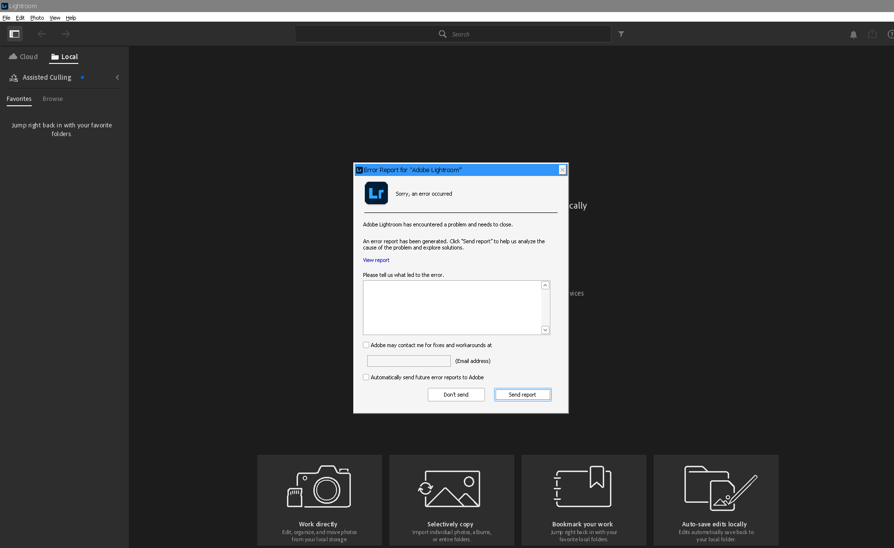

# Adobe Lightroom on Arch Linux via Wine

Running Adobe Lightroom (the Creative Cloud desktop app) on Arch Linux
under Wine. As of 2026-05-15 Lightroom launches, signs in,
authenticates against Adobe Creative Cloud, and **loads its complete
main UI** — the Local library workspace. One Wine bug remains: a COM
worker thread crashes shortly after the UI finishes loading.



## Status

| Stage | State |
|-------|-------|
| Launch + Wine boot | works |
| Direct2D / graphics init | works (patched `d2d1.dll`) |
| DirectWrite font rendering | works (Wine builtin dwrite) |
| Direct3D render loop | works (WineD3D, not DXVK) |
| WebView2 / Chromium UI | works (Edge WebView2 runtime in prefix) |
| Adobe sign-in + activation | works (with the AdobeGrowthSDK patch) |
| Media Foundation init | works (rebuilt `mf`/`mfplat`/`mfreadwrite`) |
| Main library UI | loads fully |
| Stable session | **not yet** — a COM wrong-thread crash (`RPC_E_WRONG_THREAD` → null deref at `lightroom.exe+0x28231C`) crashes a worker thread after the UI loads |

The target is the **Creative Cloud Lightroom desktop app** (`Adobe
Lightroom CC`, v9.3.1) — the cloud-synced Lightroom with Cloud/Local
libraries and Assisted Culling. That is the intended app.

### The remaining bug

After the full UI loads, a background worker thread makes a COM call
that returns `RPC_E_WRONG_THREAD` (an interface used from the wrong
apartment — Wine's COM apartment-threading model differs from
Windows). LR's own code does not null-check the failed result and
crashes. Fixing it needs Wine COM-apartment work or a binary patch to
`lightroom.exe`. See `docs/attempt-7-signin-and-media-foundation.md`.

## Run it

```sh
./run-lightroom.sh
```

Then sign in with your Adobe Creative Cloud account in the WebView2
sign-in page. To close Lightroom: `~/opt/wine-adobe/files/bin/wineserver -k9`
(the Wine window does not honor the WM close button).

## How it works

Full recipe and rationale: **[docs/WORKING-CONFIGURATION.md](docs/WORKING-CONFIGURATION.md)**.

The stack:

| Layer | Choice |
|-------|--------|
| Wine | PhialsBasement patched Wine 10.0 (bundled binary, `~/opt/wine-adobe`) |
| `d2d1.dll` | Patched — `D2D1ColorManagement` effect registered + non-delay imports |
| dwrite | Wine builtin (`dwrite=b`) |
| Direct3D | WineD3D (`d3d11=b;dxgi=b;d3d10core=b;d3d9=b`), not DXVK |
| WebView2 | Microsoft Edge WebView2 runtime copied into the prefix |
| X11 | `UseXVidMode=N` (Hyprland/XWayland) |

## The four blockers solved

1. **Direct2D init** — Wine's `d2d1.dll` lacks the `ColorManagement`
   effect; LR fails with `HResult 0x88990028`. Fixed by patching
   `dlls/d2d1/effect.c` to register `CLSID_D2D1ColorManagement`.

2. **dwrite "delay-load" crash** — diagnosed with `minidump_stackwalk`:
   the real cause was d2d1's delay-load helper writing the resolved IAT
   entry past the end of the image (mingw-16.1.0 build vs the bundled
   Wine loader). Fixed by moving `dwrite xmllite ole32` from
   `DELAYIMPORTS` to `IMPORTS` in `dlls/d2d1/Makefile.in`.

3. **Crash at `lightroom.exe+0x28231C`** — a null-pointer crash in an
   AgKernel Lua startup worker, caused by DXVK. Fixed by using WineD3D
   instead.

4. **WebView2 missing** — LR's account UI requires the Edge WebView2
   runtime. Fixed by copying the WebView2 Evergreen runtime into the
   prefix and pointing LR at it with `WEBVIEW2_BROWSER_EXECUTABLE_FOLDER`.

Dead end recorded: rebuilding Wine from source WoW64-style
(`--enable-archs=i386,x86_64`) produced a systemically broken Wine. The
bundled Wine ships separate `wine`+`wine64`; do not rebuild WoW64-style.

## The journey

Seven attempts, fully documented in `docs/`:

- `docs/attempt-2-*` — PhialsBasement patched Wine, CC installer (CEF
  blue-screen failures)
- `docs/attempt-4-*` — first `d2d1` ColorManagement patch; dwrite crash
- `docs/attempt-5-*` — full Wine rebuild dead end
- `docs/attempt-6-*` — delay-load fix, WebView2, WineD3D — UI renders
- `docs/attempt-7-*` — sign-in (SetThreadpoolTimerEx), Media Foundation,
  COM wrong-thread crash
- `docs/WORKING-CONFIGURATION.md` — the recipe

Wine patches: `installers/wine-patches/`.

## Repo structure

```text
run-lightroom.sh          launch script (working config)
docs/
  WORKING-CONFIGURATION.md  final recipe
  attempt-*.md              per-attempt technical log
  screenshots/              proof
installers/
  wine-patches/             d2d1 patches
  stubs/                    stub DLL sources
scripts/
  approaches/               install/test harnesses
tests/
```

## License

MIT. See [LICENSE](LICENSE).
