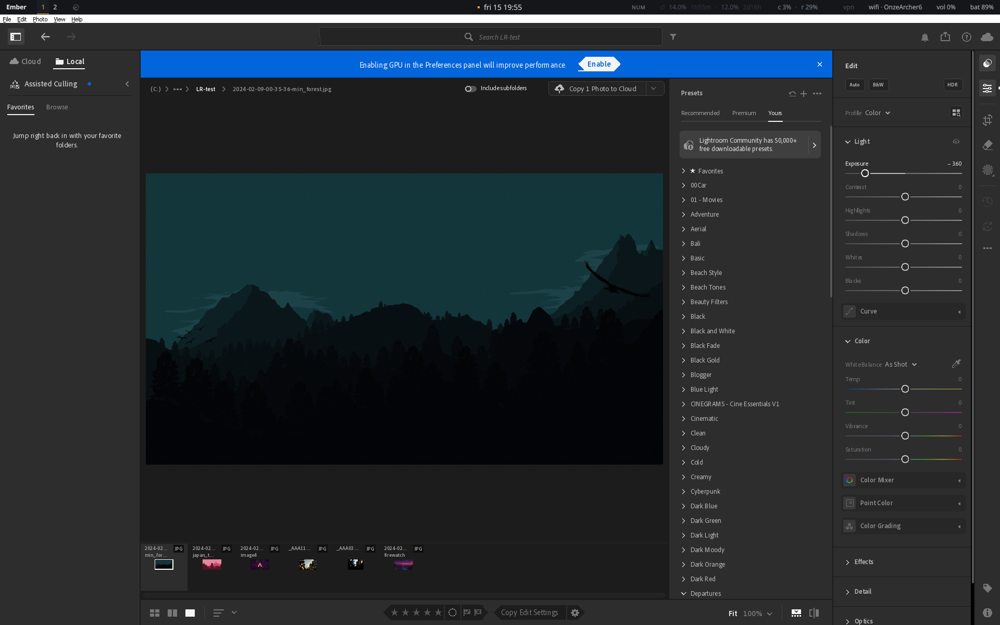

# Adobe Lightroom on Arch Linux via Wine

Running Adobe Lightroom (the Creative Cloud desktop app) on Arch Linux
under Wine. As of 2026-05-15 it **works**: Lightroom launches, signs
in, authenticates against Adobe Creative Cloud, loads its full UI,
browses the local filesystem, opens and displays photos, and **edits
them** — the develop sliders work and visibly change the image.



## Status

| Stage | State |
|-------|-------|
| Launch + Wine boot | works |
| Direct2D / graphics init | works (patched `d2d1.dll`) |
| DirectWrite font rendering | works (Wine builtin dwrite) |
| Direct3D render loop | works (WineD3D, not DXVK) |
| WebView2 / Chromium UI | works (Edge WebView2 runtime in prefix) |
| Adobe sign-in + activation | works (with the AdobeGrowthSDK patch) |
| Media Foundation init | works (rebuilt `mf`/`mfplat`/`mfreadwrite`) |
| Main library UI | loads fully |
| COM wrong-thread crash | fixed (binary patch to `lightroom.exe`) |
| Stable session | works — UI stays up, accepts input |
| Browse filesystem + show photos | works — folder tree, thumbnail grid |
| Open a photo (loupe / Compare) | works — full-size render |
| Edit panel + develop sliders | works — edits apply with no flashing (CPU rendering) |
| Crisp UI | works — virtual desktop sized 1:1 to the monitor |
| GPU acceleration | off — Wine's D3D12 preview path flickers while editing |

The target is the **Creative Cloud Lightroom desktop app** (`Adobe
Lightroom CC`, v9.3.1) — the cloud-synced Lightroom with Cloud/Local
libraries and Assisted Culling. That is the intended app.

### The two crashes that blocked it

**COM wrong-thread crash — fixed.** Every earlier session ended when a
background worker made a COM call that returned `RPC_E_WRONG_THREAD`
(an interface used from the wrong apartment — Wine's COM
apartment-threading model differs from Windows); LR dereferenced the
NULL result and crashed at `lightroom.exe+0x28231C`. Fixed by a
targeted binary patch: `0x28231C` is redirected into a code cave that
null-checks the pointer and, on NULL, routes to LR's own error/unwind
path. See `docs/attempt-8-com-crash-fixed.md` and
`scripts/patches/patch-lightroom-com-nullcheck.py`.

**CameraRaw D3D12 crash — was a misconfiguration, now resolved.**
Opening a photo crashed in `libvkd3d-1.dll` via CameraRaw → `dxgi` →
D3D12. The cause: attempt 9 had copied **vkd3d-proton**'s
`d3d12core.dll` into the prefix, mixing it with Wine's builtin
`dxgi.dll` — two incompatible D3D12 implementations. With the whole
D3D12 stack kept builtin (`d3d12=b;d3d12core=b`) there is no crash. It
is **not an upstream Wine bug**. See
`docs/attempt-10-vkd3d-investigation.md`.

### Display: crisp UI and no edit flashing

Two display problems were fixed in attempt 11. The UI looked pixelly
because the Wine virtual desktop was an undersized framebuffer
bitmap-upscaled into the window — `run-lightroom.sh` now sizes the
desktop to the monitor 1:1. And the Develop preview flashed between
the image and an empty canvas while editing: CameraRaw renders the
preview with Direct3D 12 and Wine's D3D12 present path blanks between
renders. Disabling Lightroom's GPU acceleration moves preview
rendering to the CPU — slightly slower, but flicker-free. See
`docs/attempt-11-ui-scaling-and-flashing.md`.

## Run it

```sh
./run-lightroom.sh
```

Then sign in with your Adobe Creative Cloud account in the WebView2
sign-in page. To close Lightroom, run `scripts/kill-wine.sh` (the Wine
window does not honor the WM close button, and `wineserver -k9` alone
leaves orphaned helper processes alive).

GPU acceleration is off — Wine's D3D12 preview path flickers while
editing, so CameraRaw renders on the CPU instead. The D3D12 stack is
still kept Wine-builtin (`d3d12=b;d3d12core=b`, set in
`run-lightroom.sh`) — do not drop vkd3d-proton's `d3d12core.dll` into
the prefix, as it is incompatible with Wine's builtin `dxgi.dll`.

## How it works

Full recipe and rationale: **[docs/WORKING-CONFIGURATION.md](docs/WORKING-CONFIGURATION.md)**.

The stack:

| Layer | Choice |
|-------|--------|
| Wine | PhialsBasement patched Wine 10.0 (bundled binary, `~/opt/wine-adobe`) |
| `d2d1.dll` | Patched — `D2D1ColorManagement` effect registered + non-delay imports |
| dwrite | Wine builtin (`dwrite=b`) |
| Direct3D | WineD3D (`d3d11=b;dxgi=b;d3d10core=b;d3d9=b`), not DXVK |
| WebView2 | Microsoft Edge WebView2 runtime copied into the prefix |
| X11 | `UseXVidMode=N` (Hyprland/XWayland) |

## The four blockers solved

1. **Direct2D init** — Wine's `d2d1.dll` lacks the `ColorManagement`
   effect; LR fails with `HResult 0x88990028`. Fixed by patching
   `dlls/d2d1/effect.c` to register `CLSID_D2D1ColorManagement`.

2. **dwrite "delay-load" crash** — diagnosed with `minidump_stackwalk`:
   the real cause was d2d1's delay-load helper writing the resolved IAT
   entry past the end of the image (mingw-16.1.0 build vs the bundled
   Wine loader). Fixed by moving `dwrite xmllite ole32` from
   `DELAYIMPORTS` to `IMPORTS` in `dlls/d2d1/Makefile.in`.

3. **Crash at `lightroom.exe+0x28231C`** — a null-pointer crash in an
   AgKernel Lua startup worker, caused by DXVK. Fixed by using WineD3D
   instead.

4. **WebView2 missing** — LR's account UI requires the Edge WebView2
   runtime. Fixed by copying the WebView2 Evergreen runtime into the
   prefix and pointing LR at it with `WEBVIEW2_BROWSER_EXECUTABLE_FOLDER`.

Dead end recorded: rebuilding Wine from source WoW64-style
(`--enable-archs=i386,x86_64`) produced a systemically broken Wine. The
bundled Wine ships separate `wine`+`wine64`; do not rebuild WoW64-style.

## The journey

Ten attempts, fully documented in `docs/`:

- `docs/attempt-2-*` — PhialsBasement patched Wine, CC installer (CEF
  blue-screen failures)
- `docs/attempt-4-*` — first `d2d1` ColorManagement patch; dwrite crash
- `docs/attempt-5-*` — full Wine rebuild dead end
- `docs/attempt-6-*` — delay-load fix, WebView2, WineD3D — UI renders
- `docs/attempt-7-*` — sign-in (SetThreadpoolTimerEx), Media Foundation
- `docs/attempt-8-*` — COM wrong-thread crash fixed; LR runs stable
- `docs/attempt-9-*` — CameraRaw D3D12/vkd3d crash; GPU-off workaround
- `docs/attempt-10-*` — vkd3d crash investigated: no upstream bug, it
  was a vkd3d-proton/dxgi misconfiguration
- `docs/attempt-11-*` — crisp UI (1:1 virtual desktop) and the
  Develop-edit flashing (fixed by disabling GPU acceleration)
- `docs/WORKING-CONFIGURATION.md` — the recipe

Wine patches: `installers/wine-patches/`.
Binary patch script: `scripts/patches/`.

## Repo structure

```text
run-lightroom.sh          launch script (working config)
docs/
  WORKING-CONFIGURATION.md  final recipe
  attempt-*.md              per-attempt technical log
  screenshots/              proof
installers/
  wine-patches/             d2d1 patches
  stubs/                    stub DLL sources
scripts/
  approaches/               install/test harnesses
tests/
```

## License

MIT. See [LICENSE](LICENSE).
